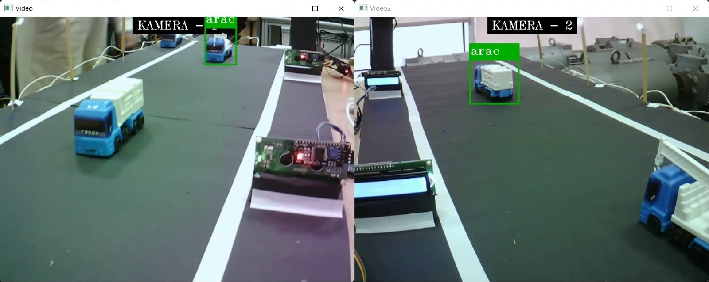
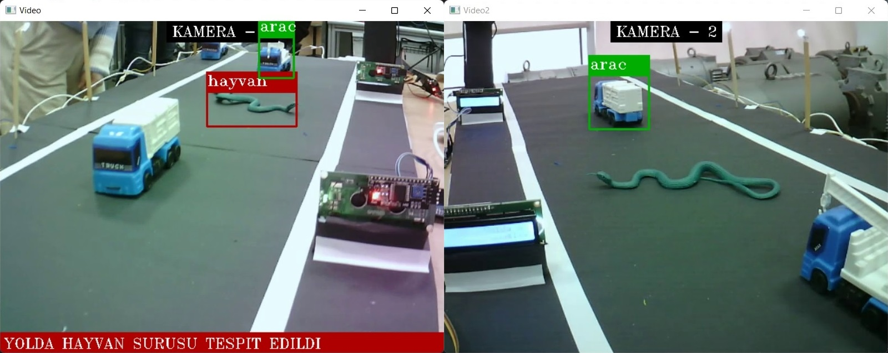
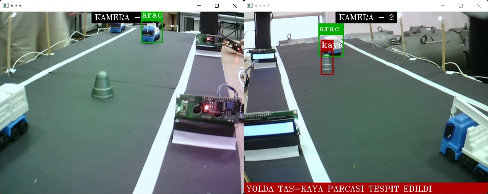

# anomaly-detection-on-highway

## Content

* Custom Object Detection with yolov3
* Finding Anomalies
* OpenCV
* Arduino with Python

## Screenshots

### Animal Detected on Highway
 

### Rock Detected on Highway
 

### Vehicle Detected in the Safety Strip on Highway
 
